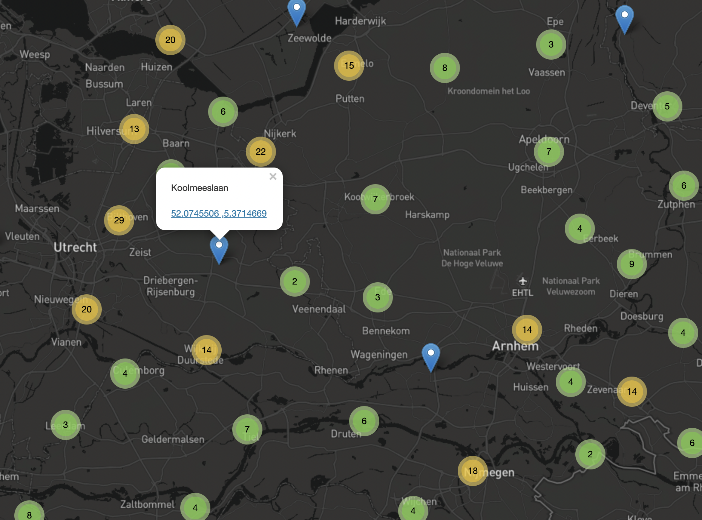

# endangered-streets
A map showing streets with names containing endangered animals in The Netherlands

Data was created in a separate project where I cross referenced a list of endangered species with streets listed in [this public dataset containing all streets in the NL](https://download.geofabrik.de/europe/netherlands.html).